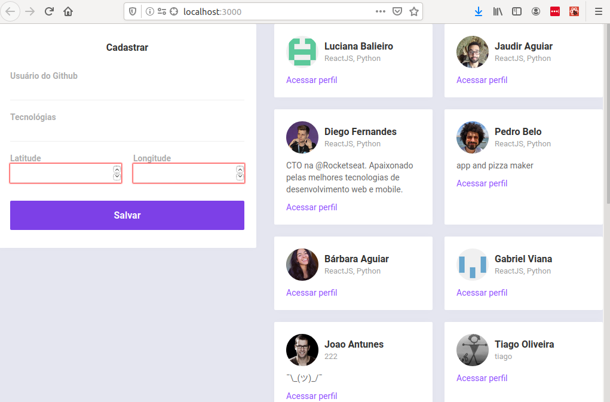
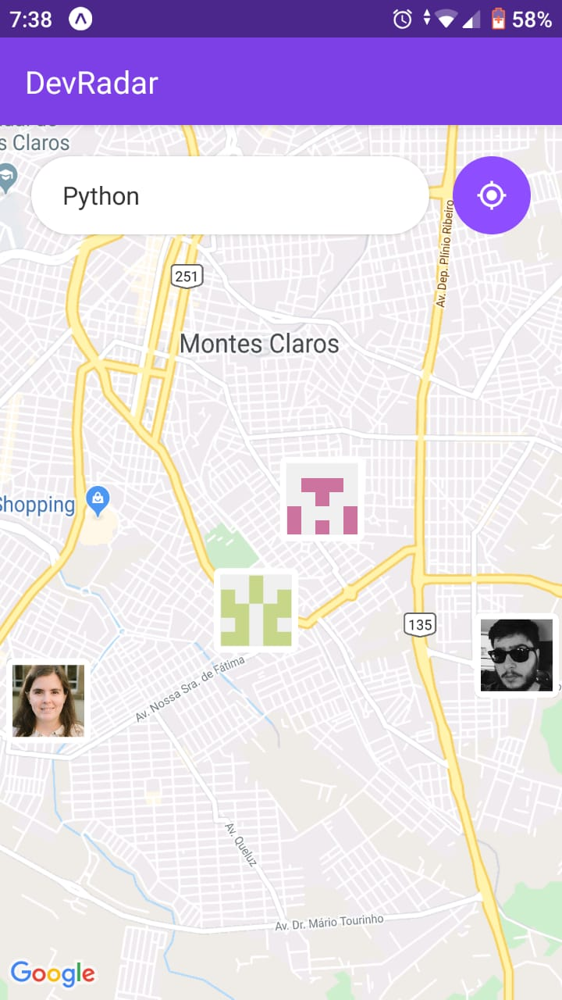

# DEV Radar app

Aplicação Desenvolvida na semana OminiStack. O objetivo da semana Oministack
foi, em uma semana, gerar uma aplicação simples: o dev-Radar. O dev-Radar permite
encontrar desenvolvedores com determinadas habilidades perto da localização
usuário.

Os dados dos devs são armazenados no mongoDB e foi desenvolvido um página web 
responsiva para o cadastros e listagem de devs. O mapa é acessado por meio de um
aplicativo de celular via expo.

Abaixo temos o visual final da aplicação.

  
  

## Dependências

É necessário ter o `yarn` instalado. Para a instalação do yarn siga as instruções
na [página oficial de instalação do yarn](https://yarnpkg.com/lang/en/docs/install/#debian-stable). 

## To Run

Para iniciar o projeto:

1. No diretório backend, no terminal execute  `yarn dev`.
2. No diretório do mobile, no termina execute `yarn start`.
3. Com o app do expo no celular, leia o código de barra 
para ter acesso ao aplicativo.
4. No diretório web, no terminal exercute `yarn start`.

## Agradecimentos

Muito obrigado a todos da Rockeseat que tornaram esse projeto possível e a comunidade
Oministack.

## Note

Este app é um projeto pessoal criado na Semana Oministack. Sinta-se livre para me mandar sugestões e correções. :hearts:

